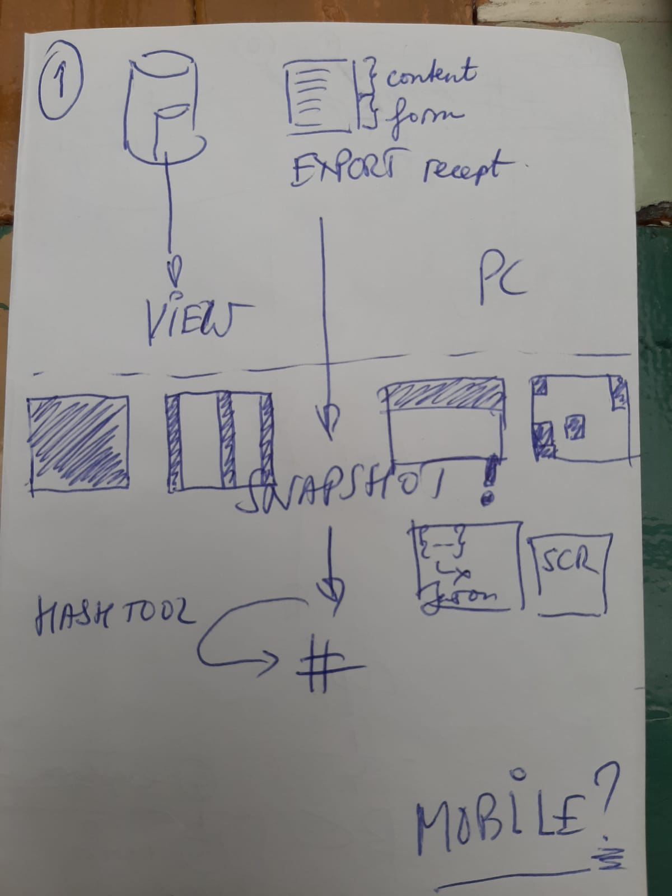

# bird

## What is _bird_?
A toolset and software to build a decentralised, trustless, and easy to use extra layer of guarantee on top of existing database systems.

## Who is _bird_ for?
For groups of people that count on accoountability. Any group of individuals and organisations. It's free to use and to adapt to your own needs. Even with unchanged objectives.

## Why do we need _bird_?
We believe you can use blockchain beneficially, 

Of course, 95%+ of the projects labeled as blockchain are pointless. Nearly all projects are just database-implementations, covered in marketing mist around the blockchain hype.

Bird consistently combines three fundamental features of open public blockchains: immutability, self sovereignty and efficiency. This garantuees the unique beneficial capabilities on top of the usual solutions.

## Why should I use bird?
1. Save time
2. Use a step by step
3. Prevent side-steps or devations
4. Known fatal mistakes ruled out by design 

## Personal motiviation
Positive turn on our negative stance towards learning the curve in society regarding this complex innovation.

## How does _bird_ do the job?
_bird_ sticks to the design principles of bitcoin and implements the building blocks needed to create an uncensorable open public blockchain application. When consistently done right, that process results in the _extra layer of guarantee_ your world has never seen before.

#### Pegging is useless if you can't locate or read what you've proved

Lots of private blockchain users claim hybrid solutions with public blockchain. Hence they think they are safe. Because anyone can verify the proof (hash) of the snapshot. Right?

No. **It's pretty useless to do this. ** Why?
To peg a private chains (in fact a *database*) to a public blockchain once a day or once week, doesn't proof anything. Because you will most likely never be able to succesfully verify it. More about that later.

In the picture below is our *core idea* to overcome this problem and create a verifiable extra layer of guarantee. What this is all about? Read our wiki and convince yourself that the solution is simple from the outside, however complex under the hood. And that's where complexity belongs: under the hood.

 

# Progress and roadmap
[Wiki](https://github.com/blockchainbird/bird/wiki)

### More details

A **Trust Network** is any group of individuals and organisations that do not want to trust each other or a third party any more.

What does _bird_ do for a Trust Network?: It looks for mistrust. Mistrust is good*.
* If you trust the situation, use a database to improve and innovate. And forget about blockchain.

Why are we looking for mistrust? Because eliminating the trust factor is a _unique feature_ of open, public, distributed, censorship-free blockchains.

The vast majority of other blockchains (private, permissioned, closed sourced, KYC'd, AML'd, etc) are pointless. Use _bird_ to be on the right side of history.

 We eat our own dogfood. 
 _Bird_ is:
 - open source
 - public
 - free
 - self-sovereign
 - uncensorable
 - borderless
 - and has no obligations to financial sponsors
 
 ## Sponsored
 
 BIRD project 2020 has been promoted by Henk van Cann. See the [project financing](https://docs.google.com/spreadsheets/d/1eNyadJXjTiy-e9Z7-HHrNIDi2LWWDivAsd_JjrQRjzE/edit?usp=sharing). It covers all out-of-pocket costs, mainly in hiring experts.
 
 ### Promote, don't claim
 
 Do you also want to promote? Let us know. You'll get nothing in return but thanks and respect, which is great and necessary. 
 
  ### no pushy shareholders or hidden interests
  
  Why should you promote if you can't claim more than a basic acknowledgement?

 - use _bird_ for commercial projects. It's open source under Apache 2.0 license and its content is CC by SA or CC by ND dependent of the type of content.
 - to contribute to a more free, self-sovereign and decentralised world where privacy is respected by design
 - create more level playing fields in the world, where centralised powers can't cheat, steal and become totalitarian rulers
 - avoid pointless blockchains and join the happy few that build meaningful blockchain applications

 ## Who owns _bird_?
Currently the legal entity is a privately owned Dutch VOF of Henk van Cann and partner. The roadmap to decentralise this entity is as follows:
- As soon as there are more than 50% donations for BlockchainBird are from parties external to the current owners of the VOF, a Not-for-profit will be set up within 2 calendar months: legal entity 'Stichting BlockchainBird Foundation' with a board.
- The board will be voted. Stake (donations) is a pré to be suggested as a candidate for a role, but anyone can be voted for.
- The voting might need to be done via a DAO.

### Why not decentralise right away?
- Because it costs time and money to do so.
- It costs time and money to maintain the 'Stichting BlockchainBird Foundation' by a board.
